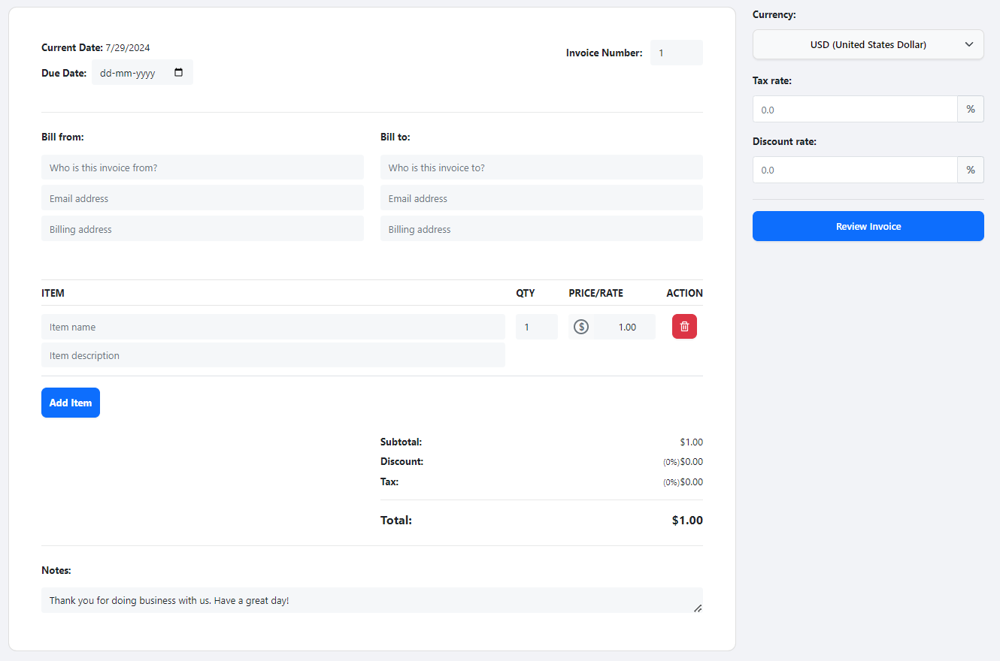
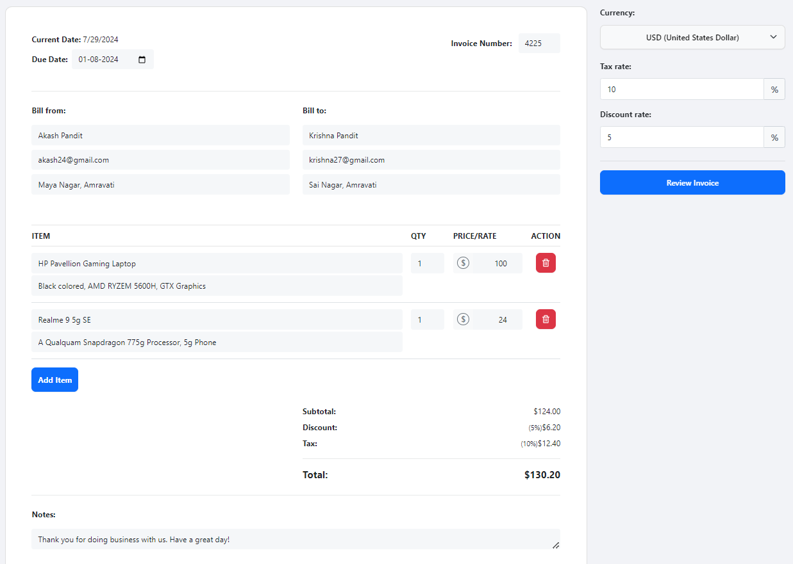
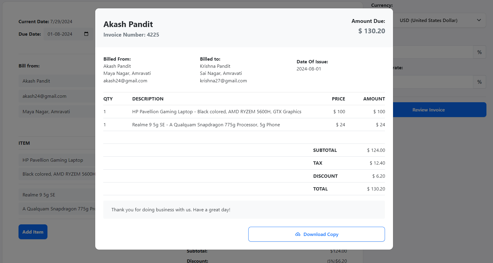
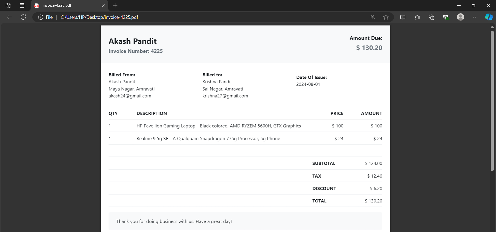

# Invoice Generator

A web application for generating invoices, built using React, provides an efficient and user-friendly solution for businesses to create and manage invoices. With its intuitive interface, users can easily input customer information, add items and services, and calculate totals with automatic tax and discount calculations. The app allows users to print invoices directly from the app, streamlining the invoicing process. It uses [jspdf-react](https://www.npmjs.com/package/jspdf-react) to capture the data from the invoice and covert it to pdf.

### To open app:
Click link: https://manavg23.github.io/INVOICE-GENERATOR/

### Built With
**:** A open-source, front-end JavaScript library.

**:** A free and open-source CSS framework.

**:** A programming language.

**[jspdf-react](https://www.npmjs.com/package/jspdf-react?activeTab=readme):** A popular JavaScript library for creating PDFs, with React components

### Features
- User-friendly interface for inputting customer information.
- Adding items and services to invoices.
- Automatic tax and discount calculations.
- Printing invoices directly from the app.
  

### Screenshots

